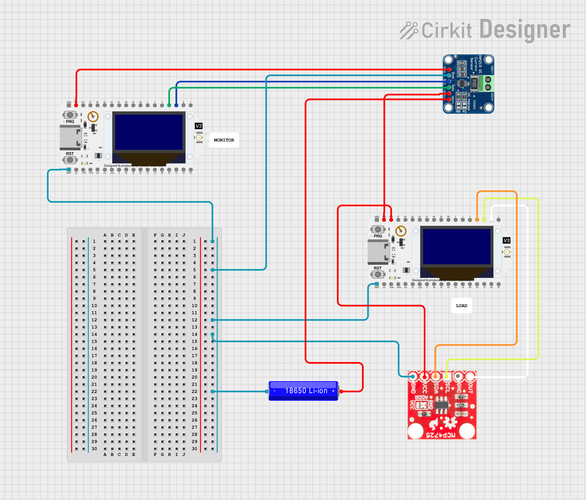
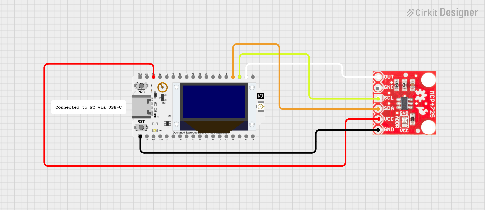
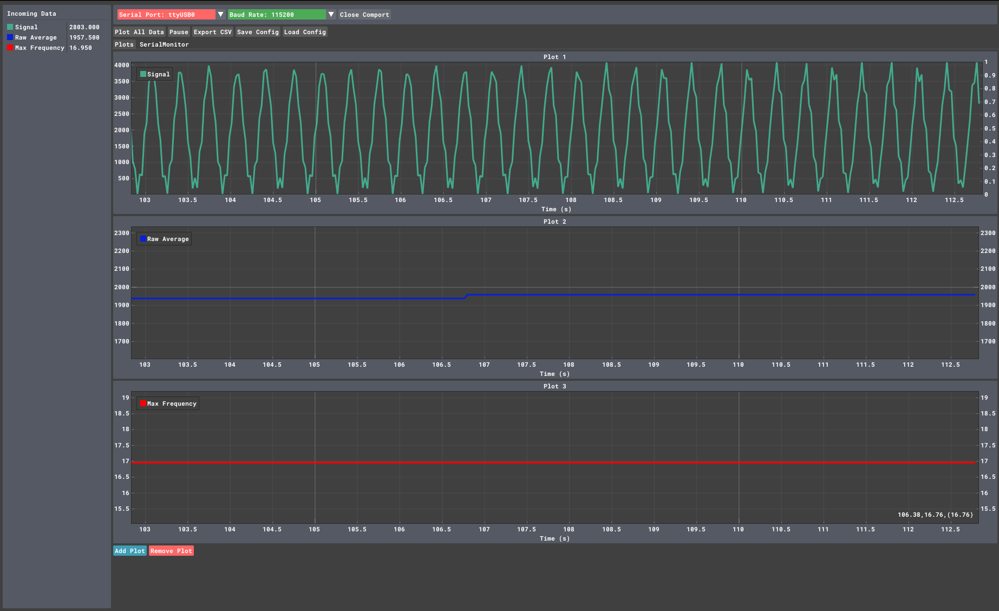
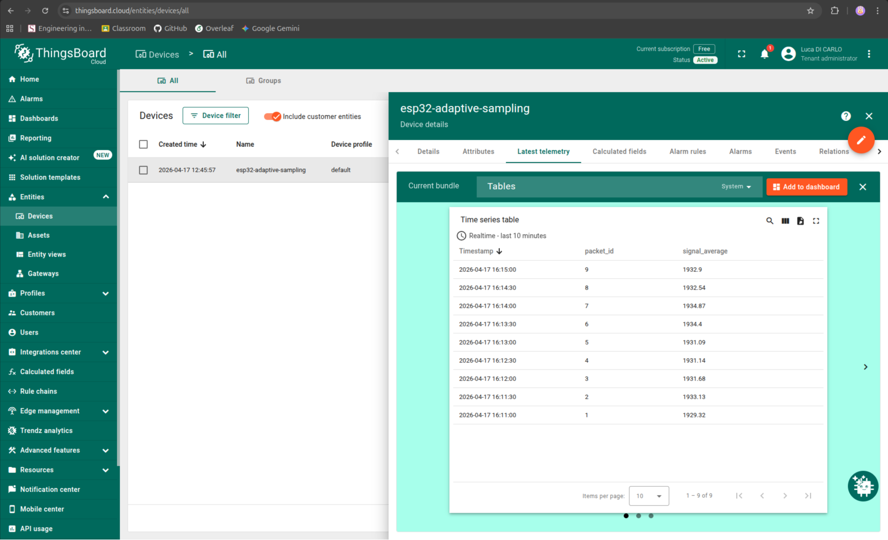
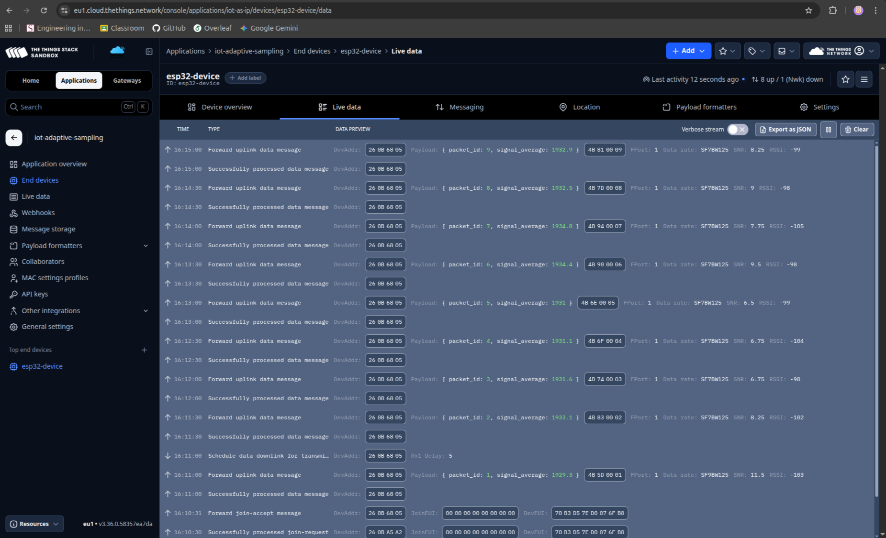
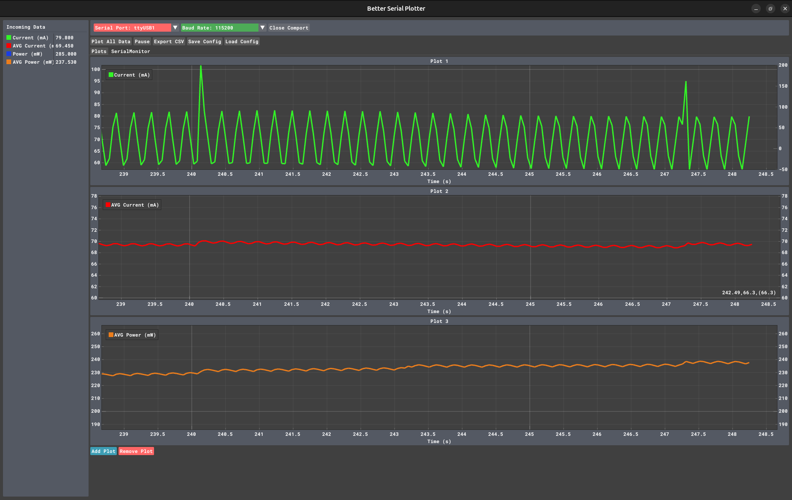
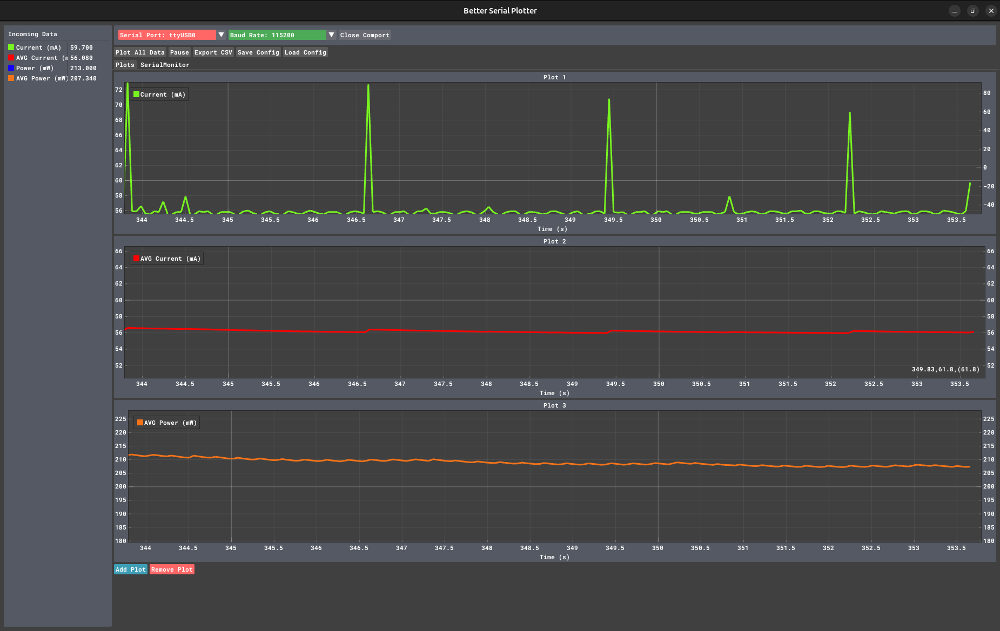
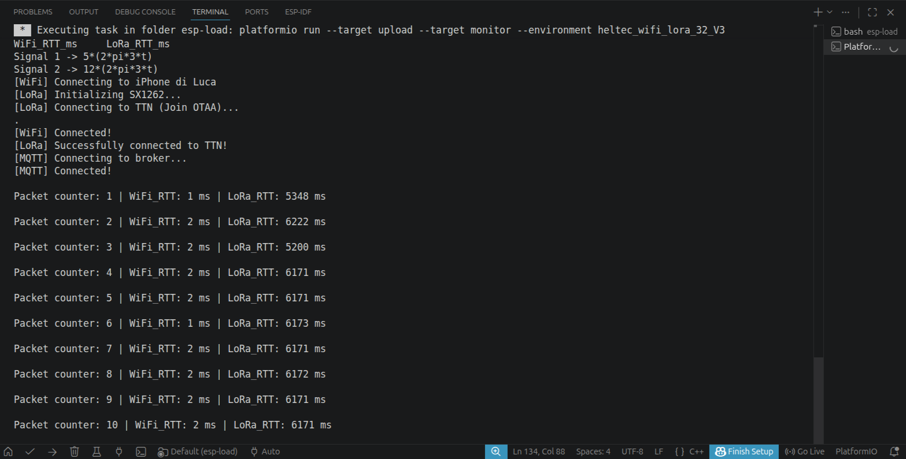

# iot-adaptive-sampling

## Abstract
The following repository contains all the material developed for the individual assignment of the Internet-of-Things Algorithms and Services course, held by Sapienza University of Rome during A.Y. 2025/2026. 
The assignment consists in developing an IoT system capable of generating a continous signal, establishing the correct sampling frequency and sending the aggregate results both on a edge server via WiFi and on a cloud server via LoRaWAN.

## Material used
- 2x ESP32 V3 (from here on called `LOAD` and `MONITOR`)
- 1x INA219
- 1x MCP4725 DAC
- 1x 3.3V LiPo battery
- 1x 400-pin breadboard
- DuPont wires

## Code structure
The code is organized in 2 different PlatformIO projects. 

The first project is meant to be loaded on the `LOAD` ESP32, as it contains the following modules:
- **Generator**, which generates the composed waveform at a certain frequency on the DAC;
- **Sampler**, which samples the signal from the DAC and runs the FFT on it to adapt the frequency;
- **Network**, which receives the aggregate data from the sampler and sends them via WiFi/LoRa for a given time window.

The second project targets instead the `MONITOR` ESP32 and is only meant for measuring the instantaneous current (in mA) and power (in mW).

## Hardware setup
I adopted 2 different setups for this whole assignment. 

The first setup only involves the `LOAD` ESP and the DAC, as I wanted to correctly implement the whole logic behind the signal generator, sampler and network trasmission. To do so, I simply plugged the USB-C cable of my PC into the ESP32 (`MONITOR`) port and connected the DAC to the MCU using DuPont wires. 



The second setup is intended to be the full setup. It involves the `LOAD` ESP32 with the DAC attached, but this time the `LOAD` is connected to a 3.3V LiPo battery rather than the USB-C port of a PC. The rest of the schematic includes another ESP32 (`MONITOR`) with an INA219 connected to it, which are meant to measure the energy consumption of the `LOAD`. To make things easier, a breadboard is also introduced in order to have a physical common ground.



## Maximum frequency
In order to identify the maximum sampling frequency of my device (`LOAD` ESP32), I chose to implement a function ```void highSpeedTestTask(void *pvParameters)``` whose goal is to perform analog reads (via ADC) on 1000 samples for 5 consecutive times without any kind of delay. At the end of this process, I averaged the results which are:
- **Average elapsed time** = 60.253 ms
- **Average maximum frequency** = 16.6 kHz
- **Average time for sample** = 60.25 us

These results were crucial to better picture my hardware limitations, while they also allowed me to understand how far I could go with the oversampling frequency in the `sampler.cpp` code.

In fact, despite this great upper bound, my hardware limitations are way deeper than 16 kHz! First of all, FreeRTOS is configured with a tick rate of 1000 Hz, so the simple fact that I'm using `vTaskDelayUntil()` is virtually bounding me to a maximum oversampling frequency of 1000 Hz. Moreover, my intensive use of the serial to plot the data is causing a massive delay which I'll quantify more precisely. 

Serial communication uses 10 bits to transmit a single byte (1 start bit, 8 data bit and 1 stop bit), meaning that transmitting 20 bytes of data for every sample with a baud rate of **115200 bps** will result in the following delay:

$$T_{UART} = \frac{20 \text{ bytes} \times 10 \text{ bits/byte}}{115200 \text{ bps}} \approx 0.001736 \text{ s} = 1736 \text{ }\mu\text{s}$$

Finally, translating this time delay in the frequency domain will mean that our maximum sampling frequency will be:

$$f_{max} = \frac{1}{0.001736} \approx 576 \text{ Hz}$$

This mathematical result forced me to fix the oversampling frequency to `500 Hz`, which considering the entity of the input signals is still pretty high. 

Below you can find the plots (signal, raw value average, maximum frequency) for the signal $s(t) = 12 \sin(2\pi \cdot 3t) + 2 \sin(2\pi \cdot 17t)$.



## Communication via WiFi and LoRa
As requested by the assignment, the raw signal is averaged over a fixed time window.
The gathered data can be transmitted both via **WiFi** using MQTT (on ThingsBoard) and **LoRa** (on TTN). For the sake of simplicity, I chose to synchronize the time window for both communications to 30 seconds. This is mainly due to the strict time limitations imposed by The Things Network, which only allows **30s** of transmission time per day. Considering we are sampling a periodic signal (so that is not subject to changes), it makes sense to widen the window. In the header file, both WiFi and LoRa can be enabled/disabled to replicate all the experiments by setting constants `WIFI` and `LORA` to 0/1 in the header file `network.h`.

The photos seen below are taken directly from the dashboards of ThingsBoard (for WiFi) and The Things Network (for Lora).




## Performance measurements
Talking about energy, it makes sense to expect a higher energy consumption in case of oversampling. That's exactly what happened!



As you can see in the plot, the signal looks very spikey due to the fact that the ESP is never really sleeping, as it is sampling every 2 ms. This implies that the average energy consumption is constantly around **69 mA**.

To put the oversampling frequency energy consumption in perspective, we should have a look at the adaptive sampling plot.



It is clear already from the instantaneous current plot that the energy consumption is mainly flat with just a peak every 3 second (approx.). The average consumption of the adaptive frequency is around 56 mA, which means implementing an adaptive frequency mechanism saves us **13 mA**, which is **~19%** of the energy consumption of the oversampling frequency!

The terminal photo below shows the computed RTTs for both WiFi and LoRa. Despite the visible stability in the measurements, I have to underline an important factor for the WiFi RTTs: the measured Wi-Fi latency represents the local TCP buffer write time (~2ms) because the PubSubClient uses QoS 0 (fire-and-forget). It does NOT represent the true RTT (which should still be in a range of 30-60 ms). Conversely, the LoRaWAN latency (~1-2 seconds) represents the true MAC-layer transaction time, as the radio must wait for the RX1/RX2 receive windows to close.



Per-window execution time...

Data volume (oversampled vs adaptive)

